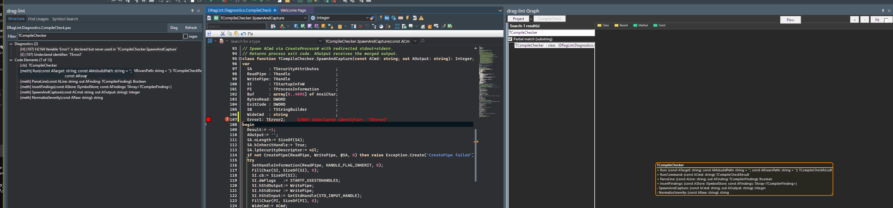
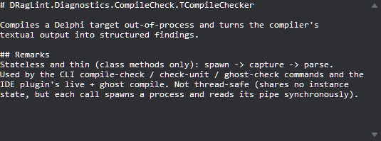
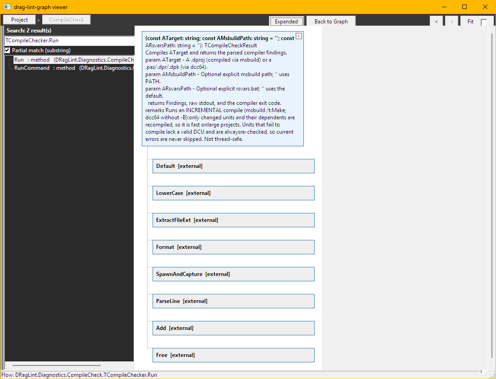
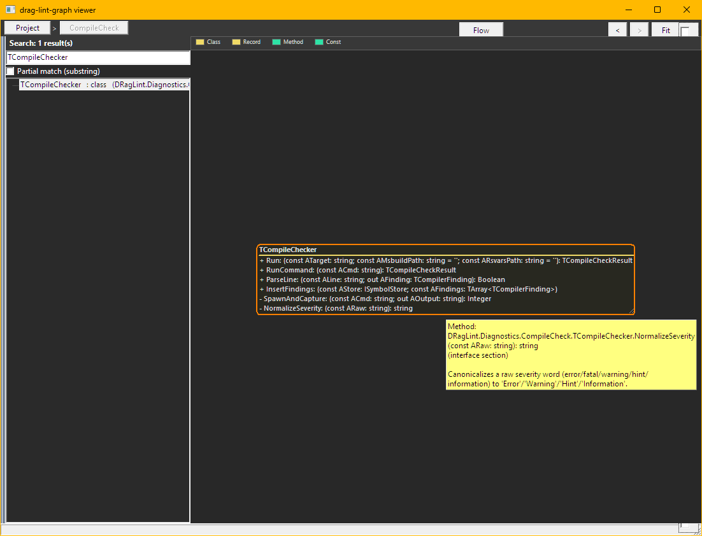
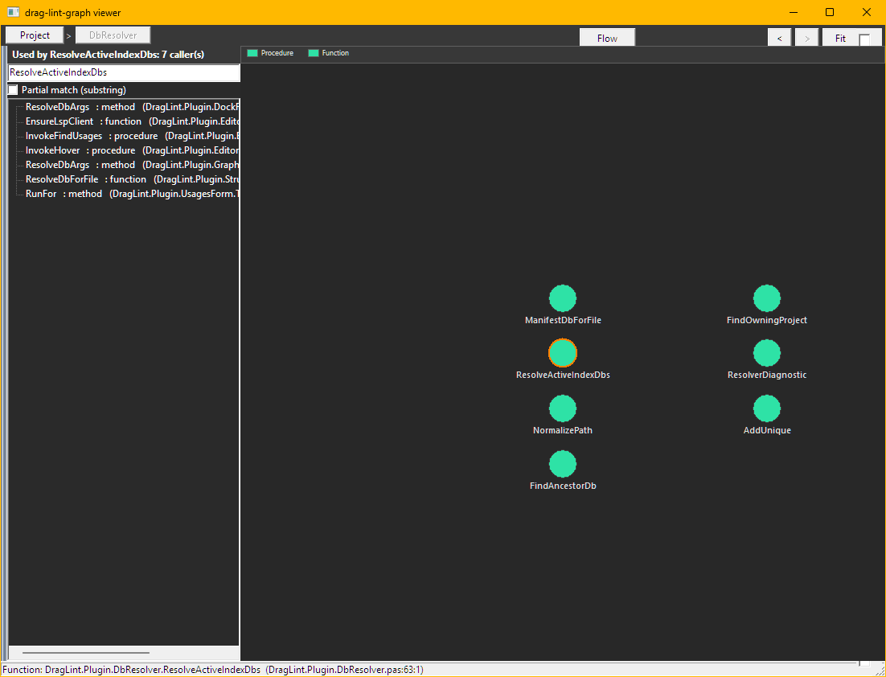
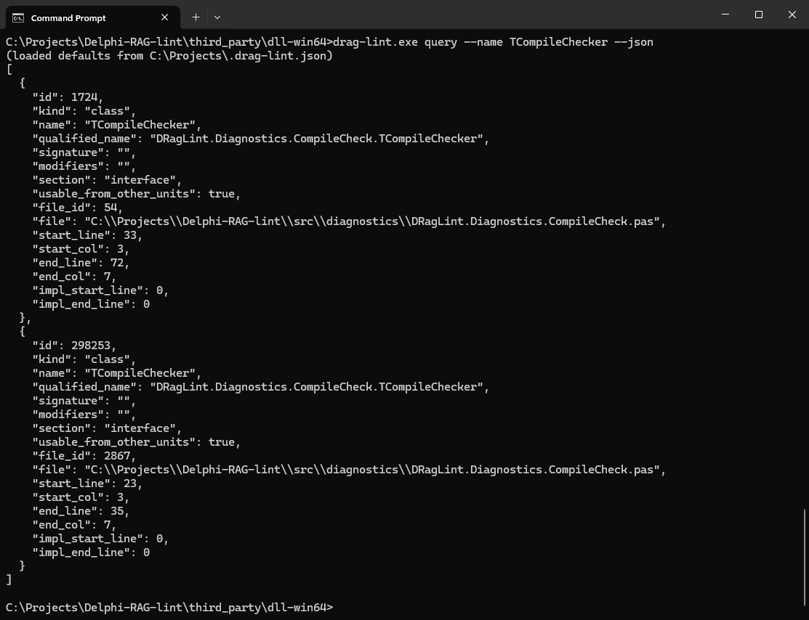
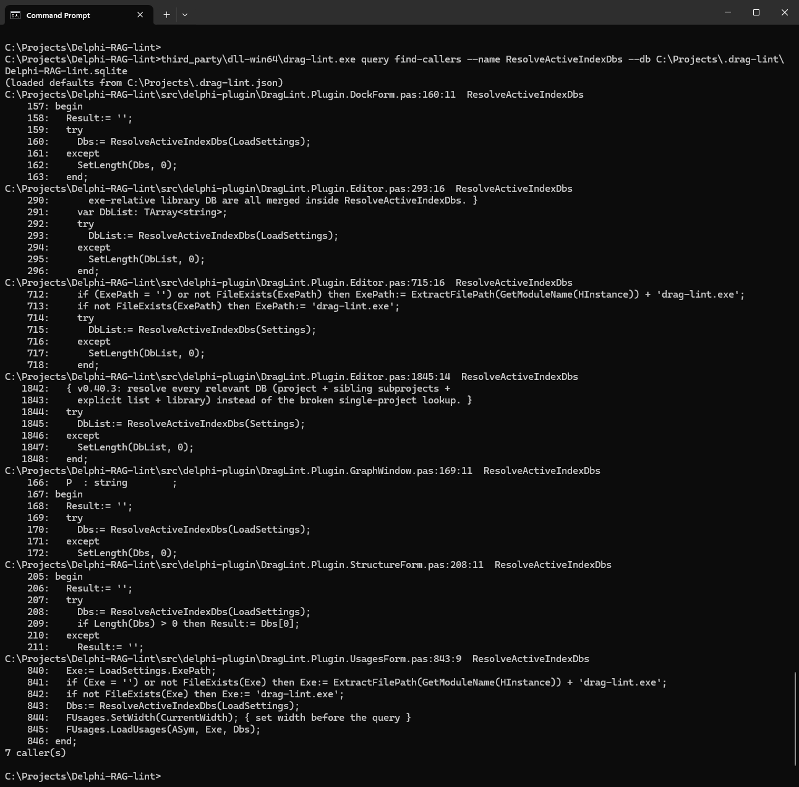
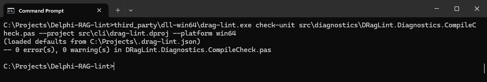

# drag-lint

[](https://github.com/Alexl-git/Delphi-RAG-Lint/releases)
[](LICENSE)

> **⚠️ Alpha / work in progress.** This is an early alpha under active, daily
> development — expect rough edges, unfinished corners, and breaking changes
> between versions. It is shared early so the Delphi community can try it and
> shape it. **Feedback and suggestions are very welcome** — please open an
> [Issue](https://github.com/Alexl-git/Delphi-RAG-Lint/issues) with ideas, bugs,
> or "I wish it could…". Not yet recommended for unattended/production use.

A symbol-aware retrieval + lint + refactoring + IDE-integration tool for Delphi.
Pure Object Pascal at runtime -- no Python, Node, or Rust. No cloud AI.

**Use it as:** CLI tool &middot; LSP server (Zed / VS Code) &middot; MCP server (Claude / Cursor) &middot; RAD Studio 13 plugin.

**→ Driving it from an AI agent? See [docs/AI-USAGE.md](docs/AI-USAGE.md)** — copy-paste instructions so your AI uses drag-lint over CLI or MCP (and reads ~10-60x fewer tokens than opening whole units).

Built on [`tree-sitter-delphi13`](https://github.com/Alexl-git/tree-sitter-delphi13)
(sibling project) and a vendored Pascal binding for libtree-sitter.

**Companion:** [`Delphi-RAG-Lint-Graph`](https://github.com/Alexl-git/Delphi-RAG-Lint-Graph)
— a standalone VCL viewer (Win64) that turns this index into an interactive symbol
graph: UML class boxes, a **Code Flow View** that renders your DocInsight comments,
a **Where-Used** caller list, search with Back/Forward history, and **editor-sync**
(the graph follows the active unit in RAD Studio). Click-to-jump back into the IDE.

---

## Screenshots

### Out-of-process compiler intelligence, inside the IDE
Live diagnostics come from compiling your buffer in a **spawned** process — even
unsaved code — so the IDE never freezes. The Structure panel and a dockable code
graph sit beside the editor.



### Your DocInsight `///` comments, in Help Insight
`<summary>` and `<remarks>` render natively in the IDE's Help Insight tooltip.



### Code Flow View
Trace a routine's calls as a flowchart — each box carries its DocInsight summary
(here `TCompileChecker.Run`).



### UML class view, with doc on hover
Search a type to see its members (visibility glyphs + full signatures); hover a
member for its DocInsight doc.



### Where Used
A precise, clickable list of a symbol's callers — 7 callers of
`ResolveActiveIndexDbs` — beside its unit's call graph.



### AST-exact symbol query (CLI)
`drag-lint query --name TCompileChecker --json` returns every match with kind,
qualified name, section, file and precise line/impl ranges — no comment or
string-literal noise.



### Find callers, with source context (CLI)
`drag-lint query find-callers` lists every caller (7 here) with the surrounding
source lines.



### Semantic compile-check from the CLI
`drag-lint check-unit` compiles a unit in its project's context and reports
findings (here: clean).



---

## Quick start

### Standalone CLI

1. Download the [latest release](https://github.com/Alexl-git/Delphi-RAG-Lint/releases)
   (`drag-lint.exe` + `tree-sitter*.dll`).
2. Put them in the same directory.
3. Index a Delphi project:
   ```
   drag-lint index C:\Projects\MyApp\MyApp.dproj --db myapp.sqlite
   ```
4. Query symbols:
   ```
   drag-lint query --name TFoo --db myapp.sqlite
   drag-lint surface --qname Unit.TFoo --db myapp.sqlite
   drag-lint impact --qname Unit.TFoo.DoBar --db myapp.sqlite
   ```

### Scan type and mode: two independent axes

**Scan TYPE is declared by the target, not by a flag:**

| Target | Type | What lands in the DB |
|---|---|---|
| `.dpr` / `.dproj` | **Project** | exactly the **compile closure** - the project's members, the project-local units they use transitively, each unit's sibling `.dfm`, the `{$I}` include files, and the project file. Units resolved through a Delphi **Library/Browsing** path are excluded (they belong to the library index), and loose unreferenced files in the project folder are excluded. |
| a folder | **Library** | every scannable file under the tree (subject to excludes). |

**MODE is chosen per run, independently of type:**

| Mode | Meaning |
|---|---|
| `--recompile` (default) | incremental - only content-changed files are re-parsed, then the resolve passes re-run. |
| `--rebuild` | from scratch. A safety valve, not a correctness requirement: on the same input both modes converge to identical content. |

Prefer **one DB per project**: a project DB answers questions about that project
exactly. A question that spans projects needs several `--db` flags -
`drag-lint resolve-dbs --platform <p>` lists every configured DB, and
`resolve-dbs --project <x.dproj>` / `--in <x.pas>` resolves a single target.

### Indexing the Delphi RTL/VCL libraries

To build one index over everything Delphi itself knows about - the IDE's
**Library** and **Browsing** search paths, read straight from the registry,
deduplicated, with `$(BDS)` / `$(Platform)` macros expanded - use the
`--scan-libraries-*` flags (no project or path needed):

```
drag-lint index --scan-libraries-win --db Library.sqlite   # Win32 + Win64 (default)
drag-lint index --scan-libraries-all --db Library.sqlite   # every registered platform
```

- **`--scan-libraries-win`** covers the IDE's native targets (Win32 + Win64).
  Because the RTL / VCL / FMX `.pas` source is shared across platforms, this
  already captures essentially all library source. (`--scan-libraries` is kept
  as a back-compat alias for this.)
- **`--scan-libraries-all`** enumerates **every** platform subkey under
  `...\BDS\37.0\Library` (Android*, iOS*, Linux64, OSX*, Win64x, ...). On top of
  the Win set it pulls in the platform-specific source trees - `source\rtl\posix`,
  `source\rtl\ios`, `posix\osx` - so symbols like `Posix.*`, `iOSapi.*`,
  `Macapi.*` and `Androidapi.*` resolve too.

Both probe HKCU + HKLM in both the 32- and 64-bit registry views and fold the
results into a single deduplicated folder set. Add `--dry-run` to print the
resolved folder list without indexing.

### I installed new 3rd-party components. How to rebuild the library index

When you install a new third-party package (DevExpress, TMS, Raize, Async
Professional, ...), its component installer registers its source/DCU folders on
the IDE's **Library** and **Browsing** search paths. The library index does
**not** update itself - it is a snapshot of those paths from the last scan, so
symbols from the new components stay unresolved until you rebuild it.

**1. Confirm what's missing (optional but quick).** `library-drift` lists every
registry root that is not yet in the index and exits non-zero if there's drift -
run it right after installing to see the new folders:

```
drag-lint library-drift                       # active platform
drag-lint library-drift --platform win64      # a specific platform
```

Any `MISSING: <path>` line is a component folder the current index doesn't cover.

**2. Rebuild the library index.** Pick whichever matches how your indexes are
managed:

- **This repo's managed indexes (recommended here).** The `Library` section of
  the named-DB manifest (`third_party/dll-win64/drag-lint.json`) has
  `"source": "registry-libraries"` and rebuilds both platform DBs
  (`C:\Projects\.drag-lint\library-Win32.sqlite` /
  `library-Win64.sqlite`) straight from the registry. Rebuild **only** that
  section - no need to touch the project indexes:

  ```
  drag-lint index --all --only Library            # both platforms, from the manifest
  drag-lint index --all --only Library --dry-run  # preview: prints the two target DBs first
  ```

- **A standalone library DB (no manifest).** Re-run the same `--scan-libraries-*`
  scan that first built it, pointing at the same `--db` file (it is rebuilt in
  place):

  ```
  drag-lint index --scan-libraries-win --db Library.sqlite   # Win32 + Win64
  drag-lint index --scan-libraries-all --db Library.sqlite   # every registered platform
  ```

**3. Verify.** Re-run `library-drift` - it should now report **0 missing** (exit
0). If a folder still shows as `MISSING`, the component didn't register that path
on the IDE search paths; add it under **Tools -> Options -> Language -> Delphi ->
Library** (Library or Browsing path) for the right platform, then rebuild again.

Notes:

- **Close nothing / rebuild anytime** - this is a CLI (`.exe`) scan; RAD Studio
  can stay open. If the target `.sqlite` is locked, an orphaned `drag-lint.exe`
  is holding it - stop that process (not the IDE) and retry.
- **After rebuilding, restart the IDE plugin's LSP** (or reopen the project) so
  the running plugin picks up the refreshed `library-*.sqlite`. The CLI sees the
  new DB immediately.
- The scan reads the RTL/VCL/FMX and third-party **source** paths; components
  shipped as DCU-only still resolve for uses/dependency purposes but won't have
  browsable source bodies.

### Untangling unit dependencies (cycles + uses cleanup)

Find circular unit dependencies and the exact `uses` lines that form them:

```
drag-lint cycles --db myapp.sqlite --edges
```

Each cycle lists its `A uses B [interface|implementation]` edges, marks the
**interface** edges as move-to-implementation candidates, and flags layering
inversions (e.g. a COMMON unit reaching into CLIENT). Add **`--causes`** to
pinpoint the *specific symbols* in `A`'s interface that force the dependency on
`B` (the types/vars/methods to move or extract) — with the line numbers, and an
honest note where the index couldn't resolve a reference.

Or generate a full **followable refactoring playbook** that a junior dev (or a
small model) can execute:

```
drag-lint cycles --db myapp.sqlite --plan > cycle-plan.md
```

Per cycle it gives the files, the load-bearing symbols (use site **and**
declaration site, with line numbers), an auto-classified fix (*extract the shared
contract*, or *invert the dependency* for layering inversions), numbered steps,
and a verify command. Build after each cycle and re-run `cycles` to confirm.

> **Worked example:** [docs/examples/circular-uses-demo/](docs/examples/circular-uses-demo/)
> is a tiny compiling two-unit cycle, with the exact `--edges` / `--causes` /
> `--plan` output drag-lint produces for it captured verbatim in
> [REPORT.md](docs/examples/circular-uses-demo/REPORT.md). (`circular-uses` is
> also a built-in lint rule, **on by default**, so `lint-project` flags cycles
> automatically.)

Then propose and apply the
cleanup, **verified by the compiler** so it never breaks the build:

```
drag-lint uses-audit MyUnit.pas --db myapp.sqlite                       # propose
drag-lint uses-fix --project MyApp.dproj --db myapp.sqlite              # dry-run sweep report
drag-lint uses-fix MyUnit.pas --project MyApp.dproj --db myapp.sqlite --apply   # apply (.bak backup)
```

> **Caveat (important):** `uses-fix`'s per-unit verify is **best-effort, not a
> faithful full-build check** — a single-unit `dcc` compile can reuse a stale
> `.dcu` (masking a real error) or abort on an RTL dependency. Treat
> `cycles`/`uses-audit` as **advisory** (they pinpoint candidates, and the index
> can miss refs like `set` types), and **always do a full project build** after
> `--apply` (revert from `.bak` if it fails). Reliable bulk cleanup needs
> full-project-build verification, not per-unit compiles.

### A cycle report, generated not written

[`circular-demo/`](circular-demo/) is a small (4-unit) sample project with a
genuine four-unit `uses` cycle that still compiles -- one of the four edges is
an `implementation` uses rather than an `interface` uses, which is exactly
what makes it legal Delphi. The full writeup is at
[circular-demo/CYCLE-REPORT.md](circular-demo/CYCLE-REPORT.md).

**This report is produced by drag-lint, not written by an AI.** It is the
literal stdout of two commands, run against the indexed project:

```
drag-lint index  --project circular-demo\CircularDemo.dproj --db circular-demo\_D-RAG\CircularDemo.sqlite
drag-lint cycles --db circular-demo\_D-RAG\CircularDemo.sqlite --edges --causes --plan --format text
```

An excerpt of the real output:

```
## Cycle 1: demologger <-> democonfig <-> demoaudit <-> demosession

### Why it cycles
- `demologger` interface uses `TDemoSession` (class) at `DemoLogger.pas:40`; declared in `DemoSession.pas:20`.
- `democonfig` interface uses `TDemoLogLevel` (enum) at `DemoConfig.pas:23`; declared in `DemoLogger.pas:15`.
- `demosession` interface uses `TDemoAuditKind` (enum) at `DemoSession.pas:35`; declared in `DemoAudit.pas:24`.

### Recommended fix
**Extract the shared contract** into a new leaf unit both can depend on (it must use NEITHER unit in this cycle).
```

Longer walkthrough: [wiki -- Circular Dependency Report](https://github.com/Alexl-git/Delphi-RAG-Lint/wiki/Circular-Dependency-Report).

### Third-party dependency report

See which external/library units the project leans on — RTL, DevExpress,
Spring4D, and anything not in your own tree:

```
drag-lint deps-report --db myapp.sqlite                 # rollup (text)
drag-lint deps-report --db myapp.sqlite --edges --format csv
```

Per external unit it reports which project units import it, how many, the
shortest uses-path, and a library grouping; `--edges` gives the flat
project-unit → external-unit list. A unit is "external" when it isn't indexed
or resolves to a library path (RTL / installed packages).

### Component conversion

Plan AND APPLY a component/type migration (`TDBEdit` -> `TcxDBEdit`, or any
`TPersistent`-rooted pair) from the REAL, AST-exact property trees of both types.
`proptree` enumerates a type's deep property tree; `convert-scaffold`
auto-drafts a validated reFind-superset rules file from both trees;
`convert-validate` checks a rules file's paths against those trees -- catching
typos that reFind's blind PCRE cannot; and `convert-apply` rewrites the real
`.pas` + `.dfm` files (dry-run by default, `--apply` to write for real, with
automatic `.BCK<n>` backups + a `recovery.txt` unless `--no-backup`). The usual
workflow: `convert-scaffold` -> `convert-validate` -> `convert-apply` (dry-run,
review the plan) -> `convert-apply --apply`. Full DSL reference, the 5
conversion surfaces, and the safety scheme: **[docs/CONVERSION-RULES.md](docs/CONVERSION-RULES.md)**.

### Consuming the index from another tool

The SQLite index is documented for external consumers in
[docs/INDEX-SCHEMA.md](docs/INDEX-SCHEMA.md) — every table, the
project-vs-external boundary, and the stability contract. Introspect any index
live with:

```
drag-lint schema --db myapp.sqlite --format json        # schema_version + tables + columns + row counts
```

### Semantic errors without a full build

`check-unit` compiles a single unit in its project's context, so you get real
compiler errors (e.g. `E2003 Undeclared identifier`) fast -- and on the
**unsaved** buffer via a shadow overlay:

```
drag-lint check-unit MyUnit.pas --project MyApp.dproj --platform win64 \
          --db myapp.sqlite --resolve-uses
```

`--resolve-uses` turns an undeclared identifier into a fix: *"add unit X to the
uses clause."*

### LSP server (Zed / VS Code)

Point your editor's LSP config at `drag-lint.exe lsp --db <path>.sqlite`.
The server speaks JSON-RPC over stdio.

Capabilities: hover, definition, references, completion, signatureHelp,
diagnostics (publishDiagnostics on didSave), workspaceSymbols.

### MCP server (Claude / Cursor)

Add to your MCP config (e.g. `~/.claude/claude_desktop_config.json`):

```json
{
  "drag-lint": {
    "command": "drag-lint.exe",
    "args": ["serve", "--db", "C:\\Projects\\MyApp\\_D-RAG\\MyApp.sqlite"]
  }
}
```

15 tools are then available to Claude: `find_symbol`, `find_callers`,
`get_symbol_doc`, `get_context_bundle`, `rename_symbol`, `run_compile_check`,
and more (see [MCP tools](#mcp-tools-15) below).

### RAD Studio 13 plugin

1. Build the BPL:
   ```
   msbuild src/delphi-plugin/dclDragLintWizard.dproj /p:Platform=Win64 /p:Config=Debug
   ```
   Or download `dclDragLintWizard.bpl` from the latest GitHub release.
2. In RAD Studio: **Component > Install Packages > Add** -- browse to the BPL.
3. Restart RAD Studio.
4. The **Tools > drag-lint** menu now has 12+ entries. Settings live under
   **Tools > Options > Third Party > drag-lint** as four pages (General /
   Indexer / Linter / Editor); per-project lint rules are reachable via a
   **"drag-lint: Project Rules..."** right-click on the project node in the
   Project Manager.
5. On IDE startup, the drag-lint logo + version appear on the RAD Studio
   splash screen. **Help > About > drag-lint** shows an entry with live
   engine self-info (version, build date, tree-sitter versions,
   capabilities, exe path, plugin log location), fetched from `drag-lint.exe`
   on a background thread so it never blocks IDE startup; if the exe call
   fails, the entry shows a structured diagnostic error block instead.

---

## Features

### Editors

`drag-lint lsp` is a stdio language server: hover, go-to-definition,
**find-references**, **workspace symbols**, completion and signature help,
answered from the index across every project in your manifest at once -- no
compiler and no project open. DelphiLSP implements neither find-references nor
workspace symbols, so those two are drag-lint only.

* **VS Code** -- extension included (`editors/vscode/drag-lint/`).
* **Zed** -- tree-sitter highlighting ships today; the language-server
  registration needs a small Rust/WASM extension that is **not yet built** and is
  fully specified for contributors.
* **Neovim / Helix / any LSP editor** -- point it at `drag-lint lsp`.

See **[docs/EDITORS.md](docs/EDITORS.md)**.

### CLI

`drag-lint <verb> [flags]`. The complete, authoritative flag list for every
verb is `drag-lint --help`; linked verbs below go to the matching wiki page
for more detail and IDE-menu context. (Wiki links point at
https://github.com/Alexl-git/Delphi-RAG-Lint/wiki and carry no `.md` suffix.)

#### Indexing

| Command | What it does | Notable flags |
|---|---|---|
| `index <path>` | Index a folder tree (a Library-type scan) | `--db`, `--watch [--interval N]`, `--library-db <lib.sqlite>` (cross-DB resolution) |
| `index --project <file.dproj>` | Index one project's **compile closure** -- members, transitively used project-local units, sibling `.dfm`, `{$I}` includes | `--dry-run`, `--watch` |
| `index --scan-libraries-win` / `--scan-libraries-all` | Index the IDE's registered Library + Browsing paths (Win32+Win64, or every platform incl. Posix/iOS/Android/OSX) | `--dry-run` |
| `index --all` | Index every section of the named-DB manifest (`drag-lint.json`) | `--only <Sec1,Sec2>`, `--platform win32\|win64`, `--jobs <n>`, `--dry-run [--json]` |
| any `index` run | Mode is chosen per run, independent of scan type | `--recompile` (default, incremental) / `--rebuild` (from scratch), `--force-reparse`, `--no-prune` (dry look), `--prune` |
| [`migrate-dbs`](https://github.com/Alexl-git/Delphi-RAG-Lint/wiki/migrate-dbs) | Move project indexes into each project's `_D-RAG` folder | `--apply` |
| [`resolve-dbs`](https://github.com/Alexl-git/Delphi-RAG-Lint/wiki/Show-Resolved-DBs-debug) | Show which DB(s) a project/file/platform resolves to | `--project <dproj>`, `--in <file>`, `--platform` |
| [`library-drift`](https://github.com/Alexl-git/Delphi-RAG-Lint/wiki/Library-Drift-Check) | Registry library roots with source on disk but not yet in the index | `--platform` |
| [`reconcile-project`](https://github.com/Alexl-git/Delphi-RAG-Lint/wiki/Reconcile-Project-Members-dpr-dproj) `<App.dpr\|.dproj>` | Sync a project's member list against disk; flag stale used units | `--apply`, `--db`, `--full` |

#### Search and navigation

| Command | What it does | Notable flags |
|---|---|---|
| `query --name <n>` / `--qname <q>` | Find symbols by name (fuzzy) or exact qualified name | `--json`, `--case-sensitive`, `--exact` |
| `query --text "<phrase>"` | Search **string literals only** -- constants, resourcestrings, DFM captions, SQL exception text | `--any-order`, `--substring`, `--source pas\|dfm\|sql`, `--limit N` |
| [`query find-callers`](https://github.com/Alexl-git/Delphi-RAG-Lint/wiki/query-find-callers) `--name <n>` | Every call-site for a symbol, with source context | `--context N`, `--resolved` (precise call-edges) |
| `query find` | Find symbols by documentation state | `--doc-tag`, `--doc-contains`, `--no-docs`, `--kind`, `--public` |
| [`query ancestors`](https://github.com/Alexl-git/Delphi-RAG-Lint/wiki/query-ancestors) `--name <t>` | Transitive class/interface ancestry | `--of <ancestor>` |
| [`query typecat`](https://github.com/Alexl-git/Delphi-RAG-Lint/wiki/query-typecat) `--name <t>` | Resolve a type's category (class/interface/float/string/...) | |
| `query hints` | List stored compiler hints/warnings | `--name <code>`, `--rule <severity>` |
| [`usages`](https://github.com/Alexl-git/Delphi-RAG-Lint/wiki/usages) `--name <n>` | Grouped usage report (backs the IDE Symbol Search dialog) | `--width narrow\|wide\|very-wide`, `--depth N` |
| [`outline`](https://github.com/Alexl-git/Delphi-RAG-Lint/wiki/outline) `--file <f.pas>` | Unit outline (backs the IDE Structure form) | `--format text\|json` |
| `hover --qname <q>` | Hover card for a symbol | `--format plain\|md\|json` |
| `typeat <file>:<line>:<col>` | Resolve the type of the expression at a cursor position | `--format text\|json` |
| [`find-unit`](https://github.com/Alexl-git/Delphi-RAG-Lint/wiki/find-unit) `--name <X> --in <file>` | Find which unit declares `X`, to add to `uses` | `--apply` |
| [`find-callees`](https://github.com/Alexl-git/Delphi-RAG-Lint/wiki/find-callees) `--qname <X>` | Resolved outgoing calls of a routine | `--json` |
| [`call-path`](https://github.com/Alexl-git/Delphi-RAG-Lint/wiki/call-path) `--from <A> --to <B>` | Shortest resolved call path A -> B | `--max-depth N` |
| [`ambiguous-calls`](https://github.com/Alexl-git/Delphi-RAG-Lint/wiki/ambiguous-calls) | Resolver-coverage diagnostic: unresolved/ambiguous call sites | `--qname`, `--file` |
| [`helpers-of`](https://github.com/Alexl-git/Delphi-RAG-Lint/wiki/helpers-of) `<T>` | Record/class helper edges targeting type `T` | `--json` |
| `impact --qname <q>` | Blast radius: callers/units affected by a change, per depth level | `--depth N` |
| `surface --qname <q>` | Public interface (declaration lines) of a class/record | `--include-impl`, `--all-visibility` |
| `slice --qname <q>` | Minimal self-contained call-slice reachable from a symbol | |
| [`context`](https://github.com/Alexl-git/Delphi-RAG-Lint/wiki/context) `--task "verb qname"` | Compact context bundle for AI prompts -- doc + surface + body + callers, ~10-60x leaner than the source | `--max-callers N`, `--context N`, `--no-docs` |
| [`bench-context`](https://github.com/Alexl-git/Delphi-RAG-Lint/wiki/bench-context) | Benchmark context-bundle throughput | `--n N` |
| `wiring --qname <IIntf\|TForm>` | Spring4D DI edges (impl + lifetime + resolve-sites) and DFM event handlers | `--coverage` (unresolved DI registrations) |

#### Lint

**173 rules across 16 categories -- 119 built-in + 54 external `.scm`, 149
enabled by default, 22 with an auto-fix.**

| Command | What it does | Notable flags |
|---|---|---|
| [`rules`](https://github.com/Alexl-git/Delphi-RAG-Lint/wiki/rules) | List the rule catalog | `--json`, `--category <name>` |
| `lint <path>` | Run built-in + external `.scm` rules on a file/folder (no index needed) | `--rule <id>`, `--disable id1,id2`, `--json` |
| `lint --file <f> --fix [--fix-line <L> --fix-rule <id>] [--apply]` | **Autofix one file.** Without `--apply` it is a dry run: reports what it would change, writes nothing. `--fix-line`+`--fix-rule` narrow to one finding; omit both to apply every fixable finding. Only rules with `"fixable": true` are ever applied | This is what the Structure form's right-click **Fix it** / **Fix all in unit** run |
| `lint --project <dproj>` | One project-scoped rule (e.g. `unit-not-in-dpr`) | `--rule` |
| [`lint-project`](https://github.com/Alexl-git/Delphi-RAG-Lint/wiki/lint-project) `--db <db>` | Project-wide structural rules -- god-class, circular-uses, layering-violation, unused-public-symbol, and more | `--rule <id>`, `--layers <f.json>` |
| `lint-all --db <db>` | Full project report: adds class metrics, duplicate code, documentation drift | `--project <.dproj>` (report only that project's compile closure), `--output <file>`, `--json`, `--lint-third-party` |
| `lint-all --fix [--apply]` | **Autofix every fixable finding across the whole project.** Dry run without `--apply` -- this is what "Fix all in project" runs; it can rewrite many files at once | |
| [`allow`](https://github.com/Alexl-git/Delphi-RAG-Lint/wiki/allow) `<file>` | Record a `dl:ok` reviewed-finding marker (dry-run unless `--apply`) | `--fix-line`, `--fix-rule` |
| [`shared-unit`](https://github.com/Alexl-git/Delphi-RAG-Lint/wiki/shared-unit) `--in <file>` | Read/extend the `dl:shared` marker for units several projects document | `--add-project`, `--apply` |

CI flags (apply to `lint` / `lint-all` / `check-ast`): `--format sarif` (SARIF
2.1.0), `--fail-on <level>` (nonzero exit at error\|warning\|info), `--baseline
<file>` / `--write-baseline <file>`, `--enable id1,id2`, `--profile <name>`.

#### Docs

| Command | What it does | Notable flags |
|---|---|---|
| `document --qname <q>` | Generate/repair a managed DocInsight comment for one symbol | `--apply`, `--json` |
| `document --unit <f.pas>` | Document every public decl in a unit (facts-only by default; trivial accessors skipped) | `--apply`, `--stubs`, `--include-accessors` |
| `document --project <p>` | Document every public decl the project owns (vendored roots skipped unless told otherwise) | `--stubs`, `--apply`, `--reindex`, `--document-third-party` |
| [`document-all`](https://github.com/Alexl-git/Delphi-RAG-Lint/wiki/document-all) | Document every public decl in every indexed unit (no project scope) | `--stubs`, `--apply` |
| `document ... --strip` | Remove drag-lint-generated doc tags/blocks (marker-keyed; hand-written docs untouched) | works on `--qname` / `--unit` / `--project` / `document-all` |
| [`doc-drift`](https://github.com/Alexl-git/Delphi-RAG-Lint/wiki/doc-drift) `--qname <X>` | Deterministic doc-vs-code drift findings for one symbol | `--json` |
| `generate-docs --qname <q>` | Generate an XML doc-comment stub | `--format xmldoc\|pasdoc` |
| `generate-test --qname <q>` | Generate a DUnitX/DUnit test-method stub | `--framework dunitx\|dunit` |

#### Refactor

| Command | What it does | Notable flags |
|---|---|---|
| `rename --kind symbol --name <q> --to <new> --db <db>` | Cross-unit rename (declaration + every reference) | `--apply`, `--no-backup`, `--json` |
| `rename --kind param --file <f> --line <L> --col <C> --to <new>` | Routine-local rename (parameter/variable) | `--apply` |
| `find-unit --name <X> --in <file> --apply` | Add the declaring unit to `uses` | |
| [`safe-delete`](https://github.com/Alexl-git/Delphi-RAG-Lint/wiki/safe-delete) `--name <q> --db <db>` | Delete a symbol iff it has zero references | `--apply`, `--json` |
| [`extract-method`](https://github.com/Alexl-git/Delphi-RAG-Lint/wiki/extract-method) `--file <f> --from-line --to-line --name <n>` | Pull a statement run into a new method | `--apply` |
| [`create-enum-helper`](https://github.com/Alexl-git/Delphi-RAG-Lint/wiki/create-enum-helper) `--qname <TEnum>` | Generate a Byte-family record helper for an enum | `--methods <csv>`, `--tostring rtti\|case` |
| `uses-audit <unit.pas> --db <db>` | Propose interface->implementation moves + unused units | `--format text\|json` |
| `uses-fix <unit.pas> --project <dproj> --db <db>` | Compiler-verified `uses` cleanup | `--apply`, `--remove-unused` |
| `format <file>` | Format a `.pas` file with the YADF formatter | `--yadf-path` |

**Formatting is safe for your suppressions.** drag-lint drives **YADF** for the
current unit or the whole active project straight from the IDE menu, and neither
`// drag-lint:ignore` comments nor `// dl:ok <rule>@<hash>` reviewed markers are
invalidated by it. A `dl:ok` hash is computed over a *normalised* line --
comments and whitespace stripped, identifiers lowercased, string literals kept
verbatim -- so reindenting and re-spacing cannot change it. Measured, not
assumed: 10 markers in a real file survived a `drag-lint format` run with
whitespace as the only difference, and one-line `try ... except end;` statements
were not rewrapped. (Splitting or joining a line *would* re-hash a marker; that
is the boundary of the guarantee.)
| [`proptree`](https://github.com/Alexl-git/Delphi-RAG-Lint/wiki/proptree) `--qname <T>` | Recursive deep-property enumerator (foundation for component conversion) | `--depth N`, `--refs-as-leaves`, `--format text\|json` |
| [`convert-scaffold`](https://github.com/Alexl-git/Delphi-RAG-Lint/wiki/convert-scaffold) `--from F --to T` | Auto-draft a valid conversion-rules file from the real F/T property trees | `--out <f>`, `--surface dfm\|pas` |
| [`convert-validate`](https://github.com/Alexl-git/Delphi-RAG-Lint/wiki/convert-validate) `--rules <f>` | Validate a conversion-rules file against the real property trees | `--print-parsed` |
| [`convert-apply`](https://github.com/Alexl-git/Delphi-RAG-Lint/wiki/convert-apply) `--unit F.pas --rules <f> --db <db>` | Rewrite all 5 conversion surfaces (dry-run unless `--apply`) | `--only Name1,Name2`, `--no-backup` |

#### Graphs

| Command | What it does | Notable flags |
|---|---|---|
| `cycles --db <db>` | Circular unit dependencies -- see the [worked example](https://github.com/Alexl-git/Delphi-RAG-Lint/wiki/Circular-Dependency-Report) below | `--edges`, `--causes` (blame the exact symbols), `--plan` (refactoring playbook), `--format json\|text` |
| `top --db <db>` | Top symbols by fan-in | `--by fanin`, `--limit N` |
| `graph --db <db>` | Export the symbol graph | `--format dot\|mermaid`, `--name <substr>`, `--output <f>` |
| [`callgraph`](https://github.com/Alexl-git/Delphi-RAG-Lint/wiki/callgraph) `--qname <X> --db <db>` | N-deep resolved call tree | `--direction callers\|callees`, `--depth N` |
| `reverse-calltree --qname <X> --db <db>` | N-deep call tree, cycle-guarded | `--direction`, `--depth N`, `--format text\|json\|dot\|mermaid` |
| [`butterfly`](https://github.com/Alexl-git/Delphi-RAG-Lint/wiki/butterfly) `--qname <X> --db <db>` | Callers (upward wing) + callees (downward wing) composed into one chart | `--depth N`, `--format dot\|mermaid\|text\|json` |
| `todos [<path>]` | Scan TODO/FIXME/HACK/XXX/REVIEW/NOTE comments | `--json` |
| [`deps-report`](https://github.com/Alexl-git/Delphi-RAG-Lint/wiki/deps-report) `--db <db>` | Third-party dependency rollup | `--edges`, `--format text\|json\|csv` |
| `uses-report --output <f.csv>` | Uses graph as CSV | `--depth N`, `--include-external` |
| `find-deadcode` | Symbols with no callers outside their own unit | `--kind`, `--include-private` |
| `forms-csv --project <dproj> --db <db>` | Test-helper navigation CSV, one row per form | `--out <f.csv>`, `--root <TfrmMAIN>` |
| `export enums --db <db>` | Export enums | `--format firebird-sql\|csv\|json\|delphi-const` |
| `export obsidian --db <db> --output-dir <dir>` | Export the index into an Obsidian vault | `--open` |
| [`diff`](https://github.com/Alexl-git/Delphi-RAG-Lint/wiki/diff) `--db <old> --db <new>` | Diff two index snapshots | `--json` |

#### Compiler

| Command | What it does | Notable flags |
|---|---|---|
| `check-unit <unit.pas>` | Compile one unit in its project's context; real compiler errors | `--project`, `--platform`, `--shadow <dir>` (unsaved buffer), `--resolve-uses` |
| `compile-check <target>` | Run msbuild/dcc and store diagnostics | `--db`, `--format json\|text` |
| `refresh-findings --project <dproj> --db <db>` | Recompile only stale units and refresh stored findings | `--full` (force full build) |
| [`ghost-check`](https://github.com/Alexl-git/Delphi-RAG-Lint/wiki/ghost-check) `<dproj>` | Compile an **unsaved** editor buffer (single- or multi-unit overlay); restores files byte-for-byte | `--unit --buffer` or `--overlays <manifest>`, `--platform` |
| [`ghost-recover`](https://github.com/Alexl-git/Delphi-RAG-Lint/wiki/ghost-recover) `<dproj>` | Restore files left overlaid by an interrupted ghost-check | |
| `import-log <logfile> --db <db>` | Parse a saved dcc/msbuild log into the DB | |
| [`pp-profile`](https://github.com/Alexl-git/Delphi-RAG-Lint/wiki/pp-profile) | Print the resolved `{$IFDEF}` define profile for a project | `--dproj`, `--platform`, `--config Release\|Debug` |
| [`preprocess-file`](https://github.com/Alexl-git/Delphi-RAG-Lint/wiki/preprocess-file) `--file <f>` | Print `{$IFDEF}`-resolved source to stdout (diagnostic) | `--define`, `--numeric K=V` |

#### Database

| Command | What it does |
|---|---|
| [`fb-snapshot`](https://github.com/Alexl-git/Delphi-RAG-Lint/wiki/fb-snapshot) `--connection "..." --db <db>` | Snapshot a live Firebird schema into an index |
| [`link-orm`](https://github.com/Alexl-git/Delphi-RAG-Lint/wiki/link-orm) `--db <projDb> --db <sqlDb>` | Link ORM classes/fields to tables/columns |

`index` also indexes `.sql` migration scripts, including `CREATE EXCEPTION`
messages from `MS*.sql` files by default (`--no-sql-ms` to index every `.sql`).

#### Servers

| Command | What it does |
|---|---|
| [`serve --db <db>`](https://github.com/Alexl-git/Delphi-RAG-Lint/wiki/serve) | Start the **MCP** stdio server -- for AI agents (Claude, Cursor). Nothing in the IDE uses this. |
| [`lsp --db <db>`](https://github.com/Alexl-git/Delphi-RAG-Lint/wiki/lsp) | Start the **LSP** stdio server -- what the IDE plugin (and Zed/VS Code/Neovim/Helix) starts. |

#### Maintenance

| Command | What it does | Notable flags |
|---|---|---|
| [`schema`](https://github.com/Alexl-git/Delphi-RAG-Lint/wiki/schema) `--db <db>` | Self-documenting live index schema: tables, columns, row counts | `--format text\|json`, `--output <f>` |
| [`info`](https://github.com/Alexl-git/Delphi-RAG-Lint/wiki/info) | Engine self-info: version, build date, tree-sitter versions, capabilities | `--json` |
| [`dump-refs`](https://github.com/Alexl-git/Delphi-RAG-Lint/wiki/dump-refs) `<file> --db <db>` | Diagnostic: refs + enclosing-symbol attribution | |
| [`dump-call-edges`](https://github.com/Alexl-git/Delphi-RAG-Lint/wiki/dump-call-edges) `--db <db>` | Diagnostic: resolved call edges | |
| `check-ast <file>` | Run tree-sitter lint rules without compiling | `--format text\|json` |
| [`purge-locals`](https://github.com/Alexl-git/Delphi-RAG-Lint/wiki/purge-locals) `--db <db>` | Size escape hatch: drop local-var/param symbols + VACUUM (call graph unchanged; re-inflated on next index) | `--json` |
| [`workspace index`](https://github.com/Alexl-git/Delphi-RAG-Lint/wiki/workspace-index) / [`status`](https://github.com/Alexl-git/Delphi-RAG-Lint/wiki/workspace-status) / [`add <dproj>`](https://github.com/Alexl-git/Delphi-RAG-Lint/wiki/workspace-add) | Multi-project workspace management | `--config <file>` |
| `--version` / `--help` | Print version / usage | |

### MCP tools (15)

Verified against `src\mcp\DRagLint.MCP.Server.pas` (`HandleToolsList`) -- this
is the complete set the server registers; it does not expose `import_log`,
`format_file`, `workspace_status` or `workspace_index` as MCP tools (those are
CLI-only verbs).

| Tool | Description |
|------|-------------|
| `find_symbol` | Find symbols by exact name (fuzzy fallback) or by qualified name; returns file:line:col |
| `find_callers` | Every reference site to a method/event-handler by name; `context` adds surrounding source lines |
| `lint` | Run the linter (built-in + external `.scm` rules) on a file or folder |
| `get_symbol_doc` | Structured DocInsight comment for a qualified symbol -- summary, params, returns, exceptions, since, deprecated, raw block |
| `find_by_doc_tag` | Symbols tagged `deprecated`, or carrying a `since` annotation |
| `find_undocumented` | Symbols with no doc comment; filter by `kind` / `public_only` |
| `get_impact` | Transitive blast radius of a symbol: callers/units affected, per depth level |
| `get_wiring` | Spring4D DI edges (interface -> impl class + lifetime + resolve-sites) plus DFM event handlers for a form |
| `get_surface` | Public interface (declaration lines) of a class/record; `include_impl` / `all_visibility` widen it |
| `get_slice` | Minimal self-contained source slice (header + class decl + method bodies) for a class |
| `get_context_bundle` | Curated context bundle for a task on a symbol -- doc + surface + slice + callers + token estimate |
| `get_type_at_position` | Resolve the identifier at file/line/col to a symbol |
| `rename_symbol` | Preview (`dry_run`) or apply a cross-unit rename of a symbol |
| `run_ast_checks` | Compiler-less AST diagnostics on a file (unbalanced begin/end, undeclared identifiers) |
| `run_compile_check` | Spawn dcc/msbuild against a file or project; return H/W/E/F diagnostics as JSON |

### Lint rule pack (173 rules)

Run `drag-lint rules` for the authoritative, always-current catalog (built-in +
external `.scm`). As of v1.5.0-alpha: **173 rules across 16 categories -- 119
built-in and 54 external `.scm`, 149 enabled by default, and 22 with an
auto-fix.** The table below is a small sample of the built-in rules:

| Rule id | Severity | Description |
|---------|----------|-------------|
| `writeln-in-source` | info | Direct `WriteLn` -- use a logger |
| `goto-statement` | warning | `goto` considered harmful |
| `with-statement` | info | `with` makes scope ambiguous |
| `nested-with` | warning | Nested `with` -- scope ambiguity compounds |
| `empty-procedure-body` | info | Empty `begin..end` block |
| `large-magic-number` | info | Unaliased numeric literal |
| `case-magic-numbers` | info | Integer literal as `case` label |
| `string-equality-comparison` | info | `=` comparison on string expressions |
| `parser-error` | error | Tree-sitter `ERROR` node (malformed syntax) |
| `compiler-magic-comments` | info | TODO/FIXME/HACK/XXX in a comment |
| `assert-call` | info | `Assert()` -- ensure descriptive second argument |
| `boolean-comparison-true` | info | `X = True` or `X = False` -- redundant |
| `redundant-as-tobject` | info | `(X as TObject)` -- every object is already TObject |
| `inherited-bare` | info | Bare `inherited;` -- verify it calls the right ancestor |

Drop custom `.scm` + `.json` pairs in the `rules/` directory; see
[rules/README.md](rules/README.md) for the schema.

### RAD Studio plugin

The plugin exposes **72 entry points across four surfaces**: 56 main-menu items,
2 under `View > Tool Windows`, 13 on the Structure form's **right-click** menu,
and 1 on the Project Manager's. Auto-fix (*Fix it* / *Fix all in unit* / *Fix all
in project*) and *Allow this message* live **only** on that right-click menu.
There are also 12 `Ctrl+Alt` shortcuts (`H` hover, `C` completion, `S` signature,
`D` diagnostics, `R` rename, `M` extract-method, `I` inline info, `F` find usages,
`T` symbol search, `U` quick-fix uses, `K` reverse call tree, `B` butterfly).

**`drag-lint` menu** (top-level on the main menu bar -- falls back under Tools -- organized into submenus): Hover at Cursor, Show Completion, 
Show Signature Help, Run Diagnostics, Rename Symbol, Compile & Diagnose, Import Build Log,
Format with YADF, Show Structure, Run AST Checks, Find Usages, Symbol Search, dockable 
panels (Structure / Usages / Graph), Generate Test Helper CSV..., 
**Uses & Dependencies** submenu (cycles, uses-audit, uses-fix, reconcile, wiring, impact, reverse call tree,
**Call Graph (Butterfly)...**), 
**Reverse Call Tree (clickable, Messages window)** -- posts the N-deep upward
call tree for the symbol under the cursor as clickable rows in the IDE
Messages window (double-click a row to jump to that call site), 
**Call Graph dock tab** -- callers above and callees below the symbol as a
navigable tree (double-click a node to jump to file:line); open it via
Ctrl+Alt+B, the Uses & Dependencies menu item above, or right-click a symbol
in the Structure tab -> "Show in Call Graph", 
**Inspect Symbol** submenu (surface, slice, type-at-cursor), 
**Code Quality** submenu (dead code, undocumented, TODOs, compiler hints, top symbols),
**Generate & Export** submenu (docs, tests, enums, graph, Obsidian),
**Index & Maintenance** submenu, plus diagnostics & test tools, and
**drag-lint Options...** (opens Tools > Options focused on the drag-lint
pages).

**Keystroke bindings** (registered via `IOTAKeyBindingServices`):

| Shortcut | Action |
|----------|--------|
| Ctrl+Alt+H | Hover at Cursor |
| Ctrl+Alt+C | Show Completion |
| Ctrl+Alt+S | Show Signature Help |
| Ctrl+Alt+D | Run Diagnostics |
| Ctrl+Alt+I | In-editor diagnostic hint popup |
| Ctrl+Alt+R | Rename Symbol |
| Ctrl+Alt+F | Find Usages |
| Ctrl+Alt+T | Symbol Search |
| Ctrl+Alt+K | Reverse Call Tree (clickable, Messages window) |
| Ctrl+Alt+B | Call Graph (Butterfly) |

**In-editor diagnostics**: gutter dot markers + wavy underlines via
`IOTAEditViewNotifier.BeforeDrawLine`. Severity colours from the IDE colour
scheme registry.

**Ghost-compile (live, out-of-process)**: as you type, drag-lint compiles your
**unsaved** buffer(s) in a *spawned* process and surfaces real compiler errors
(e.g. `E2003 Undeclared identifier`) in the gutter -- without saving, and without
ever freezing the IDE. Fires automatically on idle and on tab-switch, with
multi-unit overlays so edits across several open units are all seen. Files are
restored byte-for-byte (crash-safe via a recovery journal).

**Hover tooltip** (v0.35): a 200ms timer shows `Application.HintWindow` with
the diagnostic message when the cursor is stable for 600ms over a row that has
a diagnostic. Caret-based (not pixel-precise). Toggle via Settings.

**Code lens** (v0.32): dim grey `[N callers]` text next to method declarations.

**Structure form** (v0.30): floating `fsStayOnTop` form showing the symbol
tree of the active file, updated on view activation.

**Find Usages form** (v0.33): `Ctrl+Alt+F` prompts for a symbol name; shows
callers grouped by file in a TTreeView; double-click jumps the editor.

**Symbol Search form** (v0.33): `Ctrl+Alt+T` debounced live search over the
indexed symbol table; Enter navigates the editor to the selected location.

**Native Tools > Options pages** (v0.30, split into four in Batch B): four
pages -- General / Indexer / Linter / Editor -- under Tools > Options > Third
Party > drag-lint, each backed by `INTAAddInOptions`. **All plugin settings
(exe path, DB template, indexer/linter/editor toggles) live here** -- edit a
value, click OK, and the next hover / lint / index action picks it up (no IDE
restart needed). Reopen them anytime via **drag-lint > drag-lint Options...**.
Per-project lint rules (`drag-lint-lint.json`) are edited from the drag-lint
dock's Lint Options tab, reachable via **Project Manager right-click a project >
"drag-lint: Project Rules..."**. That tab now has a **naming-convention preset
selector** (v0.97) -- pick *Embarcadero* (`AValue` params) or *House*
(`pMyParam` / `FMyField` / `TMyClass`) to bulk-set the naming rules, or *Custom*
to hand-tune them. The combo also lists **your own saved presets** (v0.99):
tune the 8 naming values, click **Save as...** and give it a name, and it's
added to the combo alongside the built-ins; **Delete** removes a saved preset
(built-ins and Custom cannot be deleted). Saved presets persist per-project in
`drag-lint-lint.json` under a top-level `naming.presets` array -- IDE-written
only; the CLI does not yet read this key.

---

## Architecture

```
drag-lint.exe
  |
  +-- CLI dispatch (DRagLint.CLI)
  |     |
  |     +-- Indexer (DRagLint.Core.Indexer)
  |     |     +-- tree-sitter-delphi13.dll  (Delphi 13 grammar)
  |     |     +-- tree-sitter-dfm.dll        (DFM grammar)
  |     |     +-- tree-sitter.dll            (libtree-sitter runtime)
  |     |     +-- SQLite storage
  |     |
  |     +-- Query / Surface / Impact / Slice
  |     +-- Lint (rule runner over .scm files)
  |     +-- Refactor (rename, doc stubs, test stubs, YADF format)
  |     +-- Compiler diagnostics (msbuild integration)
  |     +-- Workspace (multi-project shared DB)
  |
  +-- LSP server (DRagLint.LSP.Server) -- stdio JSON-RPC
  |
  +-- MCP server (DRagLint.MCP.Server) -- stdio JSON-RPC
  |
  +-- CLI context bundler (DRagLint.Context.Bundler)

dclDragLintWizard.bpl  (Delphi IDE plugin)
  +-- Wizard / menu / keystrokes / EditViewNotifier
  +-- LSP client -> drag-lint.exe lsp
  +-- DiagnosticCache -> in-editor markers + hover tooltip
  +-- CodeLensCache -> inline [N callers]
  +-- Structure / Refactor / Usages / SymbolSearch forms
  +-- Options (INTAAddInOptions, 4 pages: General/Indexer/Linter/Editor)
  +-- Project Manager menu (per-project "Project Rules..." -> Lint Options dock)
```

All three entry-points (CLI, LSP, MCP) call the same indexer, query, lint,
and refactor engine. The IDE plugin is a thin wrapper around the LSP client
plus direct CLI calls for features the LSP protocol doesn't cover.

---

## Building from source

Prerequisites:
- RAD Studio 13 Florence (37.0) with Win64 target
- `tree-sitter-delphi13` DLLs in `third_party/dll/`

Build the CLI:
```
call "C:\Program Files (x86)\Embarcadero\Studio\37.0\bin\rsvars.bat"
msbuild drag-lint.dproj /p:Config=Release /p:Platform=Win64
```

Build the IDE plugin:
```
msbuild src/delphi-plugin/dclDragLintWizard.dproj /p:Config=Debug /p:Platform=Win64
```

Run the test battery — **every** `run_*.ps1` under `tests/`, enumerated recursively
(~10 min). The driver prints the number it found; that printed denominator is the
count, not any figure written in a document. See [tests/README.md](tests/README.md) for
the definition and the rules that go with it:
```
pwsh -File tests\run_battery.ps1                    # the battery (default: everything)
pwsh -File tests\run_battery.ps1 -List              # enumerate only, print the denominator
pwsh -File tests\run_battery.ps1 -Include autodoc   # a subset, for a fast inner loop
```

Individual runners can be invoked directly, e.g.:
```
pwsh -File tests/autotest/run_smoke.ps1       # CLI + LSP server smoke
pwsh -File tests/autotest/run_formsmap.ps1    # forms-csv navigation-map smoke (fixture project)
```

Older batch harnesses in `tests/fixtures/` (`T61_hovertracker.bat`, …) are not part of
the PowerShell battery.

---

## Version history

See [CHANGELOG.md](CHANGELOG.md) for the detailed history. The current release is
**v1.5.0-alpha**; development continues daily.

---

## License

MIT. See [LICENSE](LICENSE).
