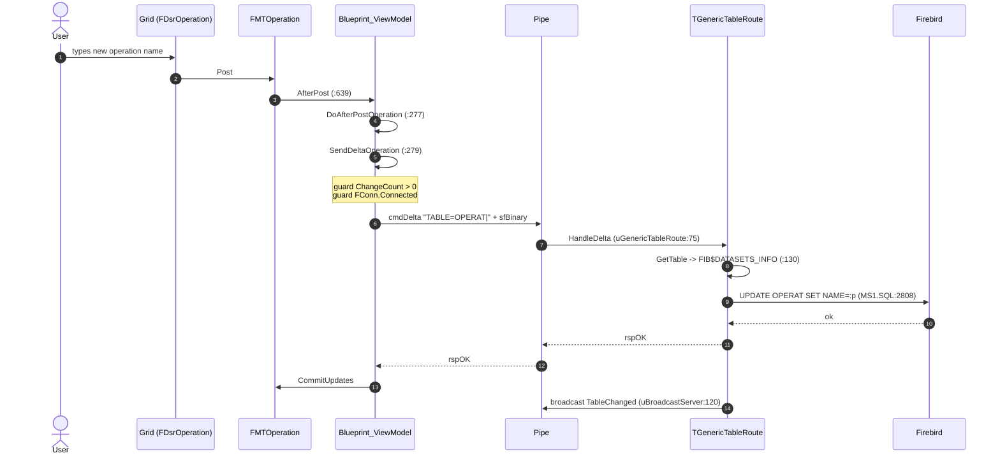

<!-- dl:fixture status=golden authored=2026-09-22 author=AI -->
# GOLDEN: OPERAT.NAME round trip (Blueprint4 -> pipe -> SERVER -> Firebird -> back)

**This file was authored WITH AI assistance, on purpose.** It is the acceptance
target for the `protocol-trace` emitter: the machine must later produce the same
INFORMATION from the index alone, with no model in the path. It is allowed to
look less polished. It is not allowed to know less.

Every node below was resolved from a drag-lint index, not from reading source.
Two project DBs were queried SEPARATELY (CLIENT and SERVER are different
projects; the authoritative-set rule forbids unioning them) plus the SQL index.

## Node inventory -- every node is a fact with a file and a line

| # | node | evidence |
|---|---|---|
| 1 | `FMTOperation` (TFDMemTable) | `CLIENT\Blueprint4.ViewModel.pas:78` |
| 2 | `FDsrOperation` (TDataSource) | `CLIENT\Blueprint4.ViewModel.pas:99` |
| 3 | AfterPost wiring | `CLIENT\Blueprint4.ViewModel.pas:639` |
| 4 | `DoAfterPostOperation` | `CLIENT\Blueprint4.ViewModel.pas:277` |
| 5 | `SendDeltaOperation` | `CLIENT\Blueprint4.ViewModel.pas:279` |
| 6 | `cmdDelta` payload contract | `COMMON\Pipes.Protocol.pas:389` |
| 7 | `TPipeSessionBuilder.HandleDelta` | `SERVER\uPipeSessionBuilder.pas:63` |
| 8 | `TGenericTableRoute.HandleDelta` | `SERVER\uGenericTableRoute.pas:75` |
| 9 | `TDatasetsDef.GetTable` | `SERVER\uDatasetsDef.pas:59` |
| 10 | `FROM FIB$DATASETS_INFO` | `SERVER\uDatasetsDef.pas:130` |
| 11 | `TGenericApplyContext.HandleUpdateRecord` | `SERVER\uGenericTableRoute.pas:63` |
| 12 | `OPERAT.NAME` (column) | `DB\SQL\MS1.SQL:2808` |
| 13 | post-commit broadcast | `SERVER\uBroadcastServer.pas:120` |
| 14 | `LoadAllForFolder` | `CLIENT\Blueprint4.ViewModel.pas:321` |
| 15 | `LoadOneTable` | `CLIENT\Blueprint4.ViewModel.pas:266` |
| 16 | `cmdTableLoad` payload contract | `COMMON\Pipes.Protocol.pas:57`, `:376` |
| 17 | `TPipeSessionBuilder.HandleTableLoad` | `SERVER\uPipeSessionBuilder.pas:59` |

---

## FORM A -- prose grammar (reads as documentation, parses deterministically)

```
TRACE OPERAT.NAME
  TITLE "How an edited operation name reaches Firebird and comes back"
  INDEX Micronite2027 + MicroniteMW1Service + SQL   AS OF 2026-09-22
  TIERS client -> pipe -> server -> database

WRITE
[01] USER EDITS grid cell "Operation Name"
       BOUND VIA FDsrOperation : TDataSource  @Blueprint4.ViewModel.pas:99
       ONTO      FMTOperation  : TFDMemTable  @Blueprint4.ViewModel.pas:78
[02] FMTOperation.Post FIRES AfterPost        @Blueprint4.ViewModel.pas:639
[03] CALLS DoAfterPostOperation               @Blueprint4.ViewModel.pas:277
       GUARD FSuppressEvents IS False         OTHERWISE SILENT
[04] CALLS SendDeltaOperation("AfterPost")    @Blueprint4.ViewModel.pas:279
       GUARD FMTOperation.ChangeCount > 0     OTHERWISE RETURNS True
       GUARD FConn.Connected                  OTHERWISE RETURNS False
[05] SERIALIZES FMTOperation TO sfBinary stream
[06] PREFIXES "TABLE=OPERAT|" AS UTF-8

[07] CROSSES process boundary
       FROM     Micronite2027.exe             -- client, Win32
       TO       MicroniteMW1Service.exe       -- server, Win64
       OVER     named pipe                    -- or TCP/IP, serial, HTTP API
       WITH     cmdDelta "TABLE=OPERAT|" + sfBinary stream
       CONTRACT                               @Pipes.Protocol.pas:389

SERVER
[08] RECEIVES cmdDelta
       AT     TPipeSessionBuilder.HandleDelta @uPipeSessionBuilder.pas:63
       ROUTES TGenericTableRoute.HandleDelta  @uGenericTableRoute.pas:75
[09] SPLITS payload AT first "|"
[10] EXTRACTS table name -> "OPERAT"
       GUARD table name IS NOT empty          OTHERWISE rspError "TABLE= prefix missing"
       GUARD delta stream IS NOT empty        OTHERWISE rspError "empty delta stream"
[11] LOADS dataset definition
       VIA  TDatasetsDef.GetTable             @uDatasetsDef.pas:59
       FROM FIB$DATASETS_INFO                 @uDatasetsDef.pas:130
       GUARD definition EXISTS                OTHERWISE rspError "no FIB$DATASETS_INFO entry"
[12] DESERIALIZES Mem.LoadFromStream sfBinary
       GUARD deserialization SUCCEEDS         OTHERWISE rspError "LoadFromStream failed"
[13] ATTACHES OnUpdateRecord                  @uGenericTableRoute.pas:479
[14] OPENS write transaction
[15] APPLIES TGenericApplyContext.HandleUpdateRecord
                                              @uGenericTableRoute.pas:63
       SELECTS arUpdate -> Def.UpdateSQL
       GUARD SQL IS NOT empty                 OTHERWISE eaFail "No SQL for arUpdate"
[16] BINDS Field.OldValue AND Field.Value TO params
[17] RUNS TFDCommand.Execute

DATABASE
[18] WRITES OPERAT.NAME                       @MS1.SQL:2808
[19] COUNTS FAppliedUpd
       RECORDS ID and OPERID INTO log         CAPPED AT 900 chars

[20] CROSSES process boundary
       FROM     MicroniteMW1Service.exe       -- server, Win64
       TO       Micronite2027.exe             -- client, Win32
       OVER     named pipe                    -- response frame
       WITH     rspOK or rspError + UTF-8 reason

RESPONSE
[21] ON rspOK
       FMTOperation.CommitUpdates             @Blueprint4.ViewModel.pas:279
       BROADCASTS TableChanged TO other clients @uBroadcastServer.pas:120
[22] ON FAILURE
       SETS  FLastPersistError FROM response payload
       CALLS FMTOperation.CancelUpdates       -- the edit is REVERTED on screen
       LOGS  PersistLog AND CodeSite

READ
[23] LoadAllForFolder                         @Blueprint4.ViewModel.pas:321
[24] CALLS LoadOneTable                       @Blueprint4.ViewModel.pas:266
       GUARD FConn.Connected                  @Blueprint4.ViewModel.pas:1133
             OTHERWISE logs "pipe not connected"
[25] BUILDS "TABLE=OPERAT|BLOBS=0|WHERE=FLDRID=N"
                                              @Blueprint4.ViewModel.pas:1134
[26] SENDS cmdTableLoad                       @Blueprint4.ViewModel.pas:1136
       CONTRACT                               @Pipes.Protocol.pas:57
       CROSSES process boundary               -- client -> server, same pipe

[27] SERVER RECEIVES AT HandleTableLoad       @uPipeSessionBuilder.pas:59
       GUARD definition EXISTS                OTHERWISE rspError
[28] READS BLOBS key                          @uPipeSessionBuilder.pas:533
     READS WHERE key                          @uPipeSessionBuilder.pas:534
[29] BUILDS column list FROM Def.NonBlobCols  @uPipeSessionBuilder.pas:538
       ADDS Def.BlobCols ONLY WHEN BLOBS=1    -- keeps lookup grids fast
[30] VALIDATES WHERE VIA TryBuildSafeWhere    @uPipeSessionBuilder.pas:549
       GUARD WHERE MATCHES "col = int [AND col = int]"
             OTHERWISE rspError               -- SQL injection defence
[31] OPENS read transaction                   @uPipeSessionBuilder.pas:590
     RUNS  Qry.Open                           @uPipeSessionBuilder.pas:594
[32] SERIALIZES Qry.SaveToStream sfBinary     @uPipeSessionBuilder.pas:597
       CROSSES process boundary               -- server -> client, rows return

[33] CLIENT LOADS stream INTO FMTOperation
       GUARD response IS rspData              @Blueprint4.ViewModel.pas:1137
             OTHERWISE logs failure           -- rspData, NOT rspOK
       NOTIFIES FDsrOperation -> grid repaints

END TRACE  33 steps, 12 guards, 4 crossings, 0 unresolved.

PROVENANCE GRANULARITY IS THE STEP, NEVER THE ENCLOSING ROUTINE.
Steps 28-32 all live inside ONE method body (HandleTableLoad,
uPipeSessionBuilder.pas:533-597). Per-method provenance would have collapsed
five distinct actions onto one header, so clicking any of them would land in
the same place. Steps 28 and 31 carry TWO lines each because they are two
statements; the grammar allows that rather than forcing a false single anchor.
```

Why this form: every capitalised word is a keyword of a fixed grammar; every
`@path:line` is a clickable span; the whole block pastes into a DocInsight
`<remarks>` without alteration. A parser turns it into nodes and edges; a human
reads it as an explanation.

---

## FORM B -- annotated Mermaid (compiler already exists)



Provenance rides as `click` directives Mermaid already supports:

```
click VM "draglint://open?file=CLIENT\Blueprint4.ViewModel.pas&line=279"
click S  "draglint://open?file=SERVER\uGenericTableRoute.pas&line=75"
```

Why this form: zero language design, renders today in Markdown viewers and in
Claude artifacts. But pasted into documentation it gives a reader SYNTAX, not
prose -- it is a diagram definition that happens to be text.

---

## FORM C -- typed records, text is a generated view

```json
{ "trace": "OPERAT.NAME",
  "index": { "client": "Micronite2027@2026-09-22",
             "server": "MicroniteMW1Service@2026-09-22" },
  "nodes": [
    { "id": "n1", "kind": "memtable", "label": "FMTOperation",
      "qname": "Blueprint4.ViewModel.TBlueprint_ViewModel.FMTOperation",
      "file": "CLIENT\\Blueprint4.ViewModel.pas", "line": 78, "tier": "client" },
    { "id": "n4", "kind": "method", "label": "DoAfterPostOperation",
      "file": "CLIENT\\Blueprint4.ViewModel.pas", "line": 277, "tier": "client" },
    { "id": "n5", "kind": "method", "label": "SendDeltaOperation",
      "file": "CLIENT\\Blueprint4.ViewModel.pas", "line": 279, "tier": "client" },
    { "id": "n8", "kind": "method", "label": "HandleDelta",
      "file": "SERVER\\uGenericTableRoute.pas", "line": 75, "tier": "server" },
    { "id": "n12", "kind": "sql_column", "label": "OPERAT.NAME",
      "file": "DB\\SQL\\MS1.SQL", "line": 2808, "tier": "database" }
  ],
  "edges": [
    { "from": "n1", "to": "n4", "kind": "event", "label": "AfterPost",
      "evidence": { "file": "CLIENT\\Blueprint4.ViewModel.pas", "line": 639 } },
    { "from": "n4", "to": "n5", "kind": "calls" },
    { "from": "n5", "to": "n8", "kind": "pipe", "label": "cmdDelta TABLE=OPERAT",
      "evidence": { "file": "COMMON\\Pipes.Protocol.pas", "line": 389 } },
    { "from": "n8", "to": "n12", "kind": "writes", "label": "UPDATE" }
  ] }
```

Why this form: trivially validated, and `compare` (before/delta/after) falls out
as a set difference over node ids. But the readable text is OUTPUT ONLY -- it
cannot be edited or re-parsed, so it is a view, never a source.

---

## FORM D -- Form A is the authority; the compiler lowers it

```
   FORM A script  (the ONLY thing stored in .dlgraph)
          |
     our parser  (deterministic, no AI)
          |
   node/edge model + provenance  (== FORM C, in memory, never authored by hand)
         /                    \
      DOT                   Mermaid
        |                       |
   Graphviz layout         markdown viewers,
   (dot.exe -Tplain)       Claude artifacts
        |
   Skia draw + hit-test
        |
   SVG / PDF / PNG "stamps"
```

Why this form: it keeps ownership of the human-facing surface -- the thing that
goes into documentation -- while borrowing every renderer that already exists.
Form C stops being an authoring format and becomes an internal data structure,
which removes the "two sources of truth" problem that Forms A and C have if both
are stored.

---

## What the machine must reproduce to pass

1. All 17 nodes, each with file and line, from the index alone.
2. Both directions -- the write path AND the read path.
3. The three guards (`FSuppressEvents`, `ChangeCount`, `FConn.Connected`) --
   these are why an edit can silently not persist, so a trace that omits them is
   less informative even if the boxes match.
4. The failure edge (`CancelUpdates` rolling the edit back on screen).
5. The tier crossing CLIENT -> pipe -> SERVER -> database, resolved across TWO
   project DBs queried separately.

Item 3 is the one to watch. Nodes and edges are mechanical; the guards are the
part a naive emitter will drop, and they carry most of the explanatory value.